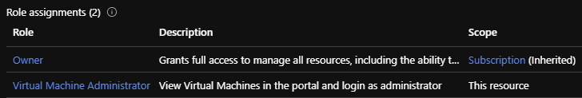
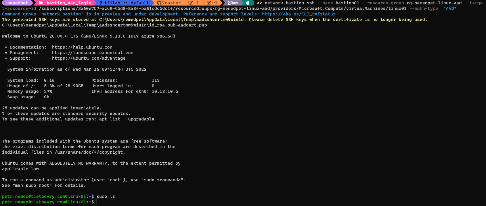
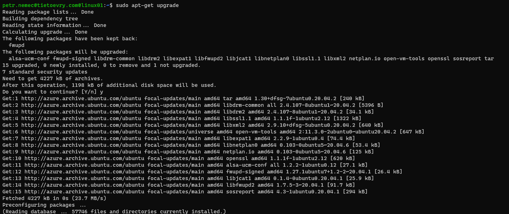

# Bastion access with AAD authentication

## Deployment

Use the template to get the resources created.

```shell
az deployment group create --name bastion_linux `
 --resource-group rg-nemedpet-linux-aad `
 --template-file main.bicep
```

### Role assignments

Grant the role Virtual Machine Administrator to the user that needs to get administrator access to virtual machines using AAD account.



## Access the Virtual machine

### Linux

Run the command below to access the virtual machine.

```shell
az resource show -g rg-nemedpet-linux-aad -n linux01 --resource-type "Microsoft.Compute/virtualMachines"

az network bastion ssh --name bastion01 --resource-group rg-nemedpet-linux-aad --target-resource-id /subscriptions/3a60e7b7-ac49-45d8-8a8f-ba61cdc5dc1f/resourceGroups/rg-nemedpet-linux-aad/providers/Microsoft.Compute/virtualMachines/linux01 --auth-type  "AAD"
```



#### Sudo access




### Windows (doesn't work)

Follow the [instructions](https://docs.microsoft.com/en-us/azure/bastion/connect-native-client-windows#connect-windows) to access Windows server by RDP.

```shell
az resource show -g rg-nemedpet-linux-aad -n windows01 --resource-type "Microsoft.Compute/virtualMachines"

az network bastion rdp --name bastion01 --resource-group rg-nemedpet-linux-aad --target-resource-id /subscriptions/3a60e7b7-ac49-45d8-8a8f-ba61cdc5dc1f/resourceGroups/rg-nemedpet-linux-aad/providers/Microsoft.Compute/virtualMachines/windows01
```

In my case the windows server wasn't accessible due to the issue caused by MFA. More information can be found in [Tshoot RDP access with AAD on the server windows01.docx](pictures/Tshoot%20RDP%20access%20with%20AAD%20on%20the%20server%20windows01.docx).