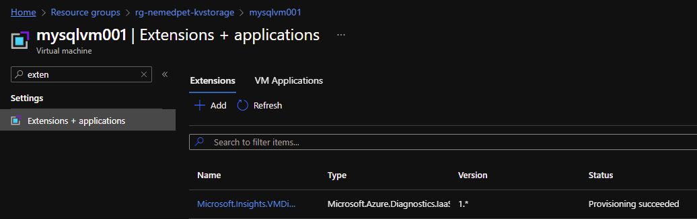
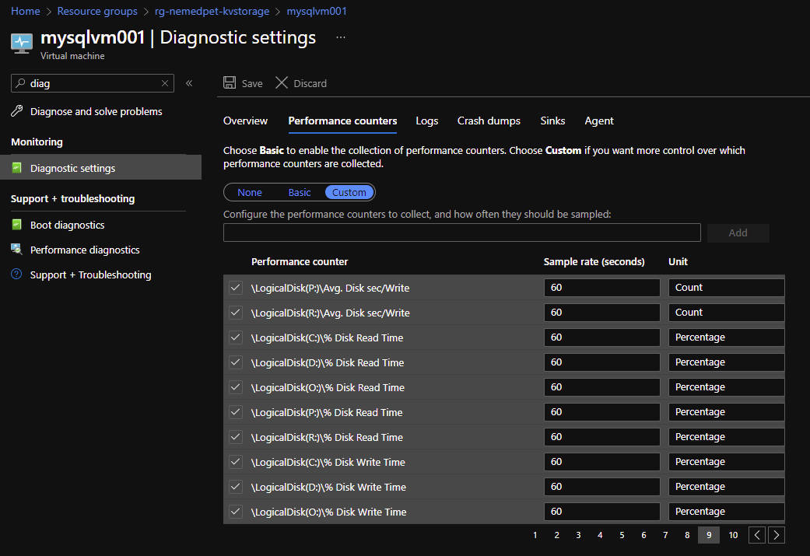

# Diagnostic Settings

The template requires the store access key as input parameters to allow the installation of diagnostic IaaS extension that stores the data to the storage account. The access key is supposed to be stored in a key vault from where is fetched by template when is being used. The parameter file references the the key vault secret in its definition.

## Resource provisioning

```shell
az deployment group create --name diagsettings `
 --resource-group rg-nemedpet-kvstorage `
 --template-file diagsettings.bicep `
 --parameters diagsettings.parameters.json
```

## Outcome

Diagnostics IaaS extension installed on the virtual machine.



The performance counters.

