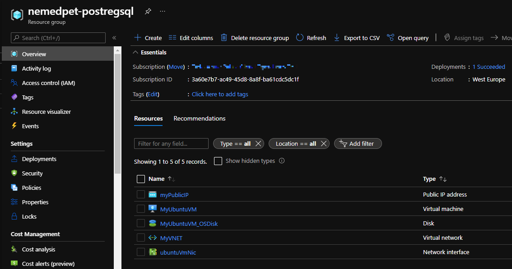

# Postgresql on Ubuntu

## Description

This code comes from the project described in the article [Deploy PostgreSQL using Infrastructure-As-Code(Azure Bicep)](https://medium.com/codex/deploy-postgresql-using-infrastructure-as-code-azure-bicep-3b563dc6427f) published on medium.com .

## Steps to reproduce

Create key pair in the cloud shell or somewhere else.

```bash
ssh-keygen \
    -m PEM \
    -t rsa \
    -b 4096 \
    -C "postgresql" \
    -f ~/.ssh/postgresql-key \
    -N yourpasshphrase
```

Create the resource group.

```powershell
New-AzResourceGroup -Name nemedpet-postregsql -Location WestEurope
```

Proceed with the deployment from PowerShell.
```powershell
$date = Get-Date -Format "MM-dd-yyyy"
$deploymentName = "nemedpet-postgresql-bicep"+"$date"


New-AzResourceGroupDeployment -Name $deploymentName -ResourceGroupName nemedpet-postregsql -TemplateFile .\main.bicep -TemplateParameterFile .\azuredeploy.parameters.json -Confirm
```

Wait until all resources are created.



Find the public IP address.

```powershell
Get-AzPublicIpAddress -ResourceGroupName nemedpet-postregsql -Name myPublicIP
```

Finally log in to the virtual machine using the public IP address and check if postgresql is installed.

```bash
ssh -i ~/.ssh/postgresql-key azuser@13.95.140.179
```