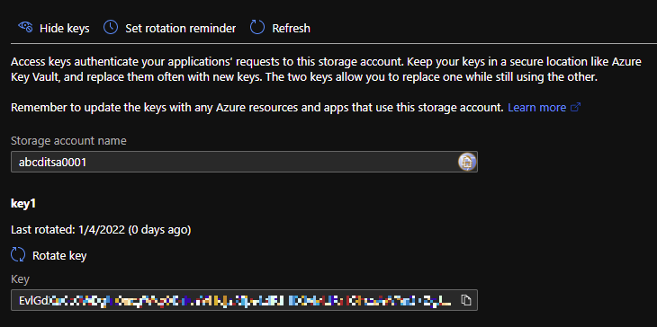
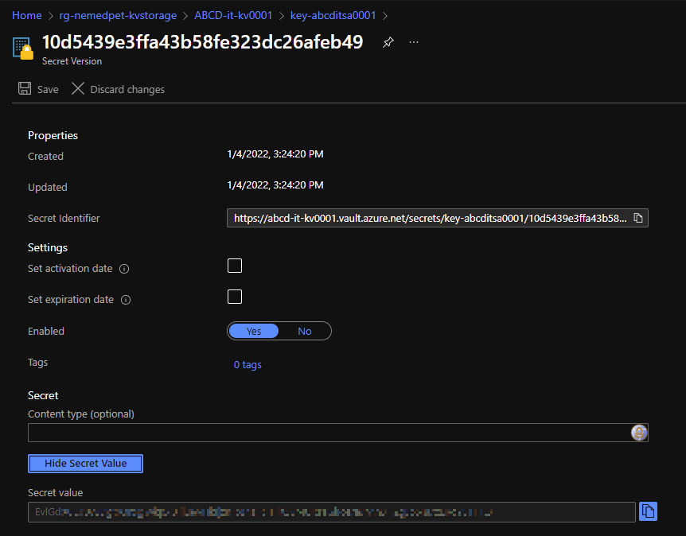

# Storage Account Key stored in Key Vault

There are two templates that may be combined in one.
First create a key vault and then in the second run create the storage account which access key is stored as secret in the key vault.

## Create Key Vault

```shell
az deployment group create --name KeyVault `
 --resource-group rg-nemedpet-kvstorage `
 --template-file keyvault.bicep `
 --parameters keyvault.parameters.json
```

## Create Storage account

```shell
az deployment group create --name StorageAccount `
 --resource-group rg-nemedpet-kvstorage `
 --template-file storageaccount.bicep `
 --parameters storageaccount.parameters.json
```

At the end the access key *key1*  



should be stored in the key vault.



As the key vault uses Azure role-based access control make sure that the role *Key Vault Secrets Officer* is granted to you to be allowed to check the secret in the key vault.
