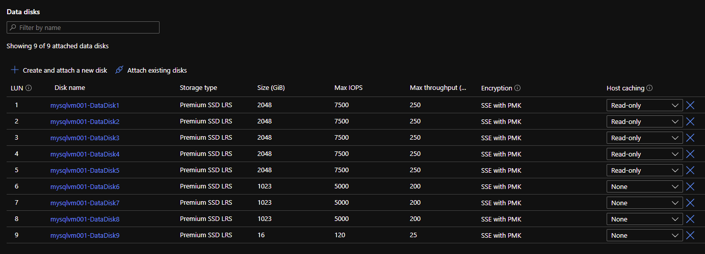

# Virtual Machine with multiple data disks

## Description

The template may be used for creating a virtual machine with multiple data disks. VM can have zero or several data disks. Each disk have their options (size, SKU etc.) and when you attach them you may also specify caching.
In this template as part of the virtual machine deployment three types of data disks are created:

- data disks
- log disks
- additional disks

Each type is represented with the parameters specifying number of disks, SKU, size and caching.

The virtual machine created by the template is supposed to be placed into an availability zone or proximity placement group in an availability set that also may be created by template.
Whether to create VM in an availability zone or availability set with  proximity placement groups depends on the parameters azDeployment, createAvailabilitySet, and createPpg. By setting right parameters multiple VMs can be created while being put into the same proximity group or different AZ which can be further on used for forming clusters.

## Notice

The template can use the virtual network and subnet from different resource group.
If this is needed than add the following parameter into parameters. By default it takes the name of the RG where the resources are created.

```shell
    "networkRg": {
        "value": "mynetwork-rg"
    },
```

## Deploy the VM

## Deploy test vNet & Subnet

```shell
az deployment group create --name vnet --resource-group rg-nemedpet-kvstorage --template-file vnet.bicep
```

Update the template parameters according to the description from [parameters.md](parameters.md).

### Availability Zone

In case the VM is to be deployed to an availability zone follow the example below.

```shell
az deployment group create --name VM --resource-group rg-nemedpet-vm-multiple-disk-1 --template-file vm_sql_multiple_disks.bicep  --parameters vm_sql_multiple_disks_params_az.json
```

### Availability Set & Proximity Placement Group

In case the VM is to be deployed to an availability set with proximity placement group follow the example below. In this example the avset and ppg are also created as part of the resource deployment.

```shell
az deployment group create --name VM --resource-group rg-nemedpet-vm-multiple-disk-1 --template-file vm_sql_multiple_disks.bicep  --parameters vm_sql_multiple_disks_params_avsetppg1.json
```

In case of deploying a VM into an existing availability set with existing proximity placement group follow the second example below. This is supposed to be used when 2nd VM is to be created within the same avset/ppg.

```shell
az deployment group create --name VM --resource-group rg-nemedpet-vm-multiple-disk-1 --template-file vm_sql_multiple_disks.bicep  --parameters vm_sql_multiple_disks_params_avsetppg2.json
```

## Result

As an example see the virtual machine created by the template that consist of the following data disks:


